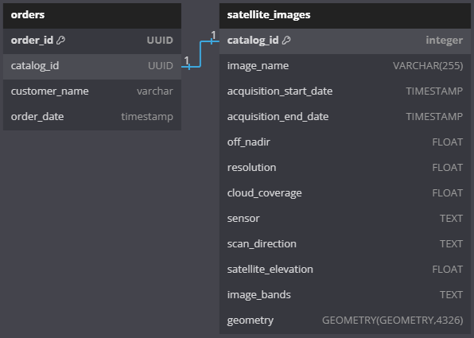
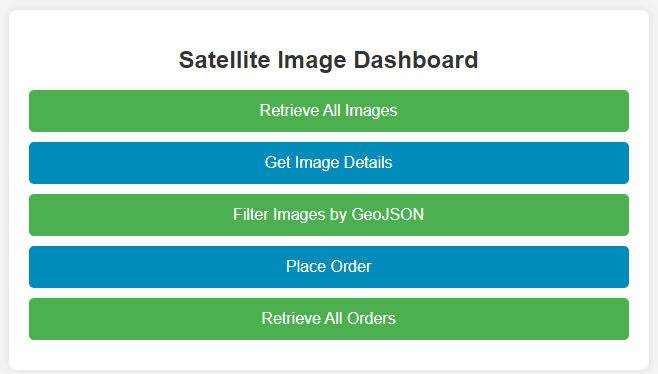

# Orbital Edge Imaging API

## Overview
The **Orbital Edge Imaging API** is a RESTful API for searching, ordering, and managing satellite images. This API is built using **Node.js, Express, PostgreSQL (PostGIS), and TypeScript**. Technical Requirements:
- Install Docker, Typescript, Postgres (and add it to env path to more easily use `plql` commands), Docker version has Postgis but please make sure you have it installed when running locally with: `psql -U postgres -d postgres` - you can also run directly on local db - `SELECT * FROM pg_available_extensions WHERE name = 'postgis';`

### Features
- **Retrieve all available satellite images**
To get all images, we use `api/images` route, it has available filters for: acquisition date, cloud coverage, and geometry, which verifies if the locations intersect. To use these filters use this route: `api/images?cloudCoverage=&{val}` and/or `api/images?acquisitionDate=&{val}`.
- Added GeoJSON filtering by inserting a json i.e. {"coordinates": [-8.614543381661207,41.1445848918807],"type": "Point"}, you can filter images by intersection, however did it an a different endpoint `/api/images/filter?geoJSON=${encodedGeoJSON}`.

- **Get details of a specific satellite image**
To get the specified image, you can use `api/image/[catalogId]`, you can get the id from the list.

- **Place an order for a satellite image**
To make an order, the user simply inputs the `catalog Id` from UI and their name. If Id is invalid, order is not processed, but app does not crash. The endpoint should be POST `api/orders`.

- **Retrieve all orders**
To retrieve all listed orders use GET `api/orders`,  you can set a limit of orders you want to retrieve, which basically is a starting point for pagination by `api/orders?limit=&{val}`

### Comprehensive Setup

After cloning the repository locally and making sure you have `yarn` installed:
1. Run `yarn install` - this installs all necessary dependencies for this project, for the dependency list check ./package.json
2. Run `yarn build-local` - this script, if there are existing `./dist` files, deletes them and copies all `.ts` and database migrations files there (this is so they can be used after compilation).
- `yarn build-local` is only for local builds as the name states, as it shouldn't be needed if **oei** is running in docker.
- `yarn dev` runs application locally with local database.
3. Run `docker network create oei_network` - although not needed, creating a network facilitates app and db communication, as it becomes unnecessary to expose the database.
4. Run `docker-compose up -d --build` - builds and runs the containers. You can run `docker ps` to check build status, but after running, docker desktop should look like:

#### Populating the database in Docker

While the containers are running:
1. Open the folder where database configuration (`.sql`) files are + Open Terminal;
2. Copy these files to Docker: `docker cp init.sql oei-db:/init.sql` and `docker cp insert-images.sql oei-db:/insert-images.sql`.
3. Create Database Model: `docker exec -it oei-db psql -U postgres -d postgres -f init.sql`.
4. Populate Satellite Images database: `docker exec -it oei-db psql -U postgres -d postgres -f insert-images.sql`.
5. (_OPTIONAL_) Enter database through terminal: `docker exec -it oei-db psql -U postgres -d postgres` and check that data is being fetched by performing a simple select: `SELECT * FROM satellite_images;`.

#### Running locally considerations
1. Change .env DB_HOST to 'localhost' instead of 'db'.
- You have to create the database locally (this can be automated in the future, with a script).
2. `yarn install && yarn dev`

## Product Decisions:
- Each order corresponds only to ONE satellite image, as per the one-to-one relation.

- Frontend is very minimal as time for implementation was limited and focused on implementing the infrastructure. It will not be possible to view the website as I did not deploy it. Both of these are due to the same reasoning: one weekend to make this work locally and containerize and the communication within containers.

## Component Diagram
- **Client (React Frontend)**: Sends API requests to the backend.
- **Router**: Maps requests to controllers.
- **Controllers**: Process API requests, validate data, and call the service layer.
- **Services**: Contain the business logic and interact with the database.
- **Database** (PostgreSQL with PostGIS): Stores satellite images and orders.

#### Proof that OEI has a very pretty dashboard

